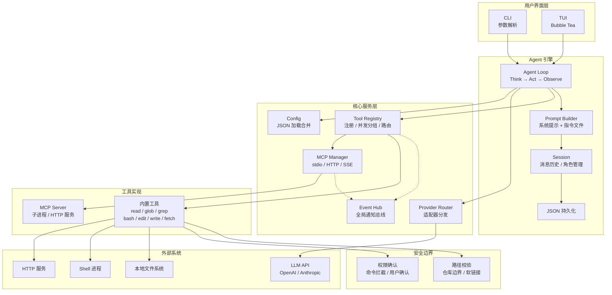

# minioc

`minioc` is a minimal local AI coding agent in Go. It now separates provider routing from model catalog metadata, so OpenAI-compatible and Anthropic backends can evolve without changing the agent loop.

## What is in this first cut

- CLI entrypoint in `cmd/minioc/main.go`
- Bubble Tea TUI as the default interface plus plain streaming CLI mode
- Session loop with `max_steps` in `internal/agent/loop.go`
- Provider registry and adapters in `internal/llm/provider/`
- Model catalog with strict `provider/model` references in `internal/llm/models/catalog.go`
- Tool registry with built-in tools, MCP server tools, and Event Hub notification system
- MCP (Model Context Protocol) support: stdio / Streamable HTTP / SSE transport
- Repo-bound path checks and confirmation prompts for write/edit/bash tools
- Streaming assistant output plus concise tool activity in the CLI
- Line-based edit diffs and write previews in confirmation prompts and tool results
- Parallel-safe tool calls can execute concurrently in one model step
- Default resource files under `assets/`
- JSON session persistence under `.minioc/sessions/`

## Quick start

`minioc` stores default static resources under `assets/`.

- `assets/minioc.json`: default configuration template

Runtime data is written under `.minioc/` (auto-created):

- `.minioc/minioc.json`: runtime configuration
- `.minioc/sessions/`: session data

Example configuration:

```json
{
  "model": "openai/gpt-5-mini",
  "max_steps": 1000,
  "auto_approve": false,
  "providers": {
    "openai": {
      "type": "openai-compatible",
      "base_url": "https://api.openai.com/v1",
      "api_key": "{env:OPENAI_API_KEY}"
    },
    "anthropic": {
      "type": "anthropic",
      "base_url": "https://api.anthropic.com",
      "api_key": "{env:ANTHROPIC_API_KEY}"
    }
  },
  "models": {
    "openai/gpt-5-mini": {
      "provider": "openai",
      "id": "gpt-5-mini",
      "supports_tools": true
    },
    "anthropic/claude-sonnet-4": {
      "provider": "anthropic",
      "id": "claude-sonnet-4-20250514",
      "supports_tools": true,
      "max_output_tokens": 8192
    }
  }
}
```

If a provider uses an env-based API key source, export the variable first:

```sh
export OPENAI_API_KEY=your_key_here
export ANTHROPIC_API_KEY=your_key_here
```

You can also set `api_key` directly to a string in `.minioc/minioc.json` when you do not want env resolution.

### MCP 工具配置

在 `minioc.json` 中添加 `mcp_servers` 配置即可接入 MCP 工具（支持 stdio / Streamable HTTP / SSE 三种 transport）：

```json
{
  "mcp_servers": {
    "fs-server": {
      "transport": "stdio",
      "command": "npx",
      "args": ["-y", "@modelcontextprotocol/server-filesystem", "."]
    },
    "weather-api": {
      "transport": "streamable-http",
      "url": "https://api.example.com/mcp",
      "headers": {
        "Authorization": "Bearer xxx"
      }
    }
  }
}
```

MCP 工具会自动注册到主 Tool Registry，工具名格式为 `{server_name}__{tool_name}`（如 `fs-server__read_file`），避免与内置工具冲突。

Launch the TUI (default mode):

```sh
go run ./cmd/minioc
```

Run against the current repository with an initial prompt:

```sh
go run ./cmd/minioc -- "summarize this repository"
```

Continue a previous session:

```sh
go run ./cmd/minioc --continue sess_xxxxx "now add tests"
```

Use plain streaming CLI mode (no TUI):

```sh
go run ./cmd/minioc --no-tui -- "summarize this repository"
```

Useful flags:

- `-C` to change the working directory
- `--continue` to resume a previous session id
- `--no-tui` to force plain streaming CLI mode

## 系统架构

minioc 是一个运行在本地的 AI coding agent，核心是一个 **Think → Act → Observe** 迭代循环。

### 系统架构图



### 模块说明

| 模块 | 职责 | 关键接口 / 抽象 | 实现包 |
|---|---|---|---|
| **CLI** | 参数解析、组件组装、启动模式选择 | — | `cmd/minioc` |
| **TUI** | 终端富文本交互、流式渲染、权限对话框 | Bubble Tea `Model` | `internal/tui` |
| **Agent Loop** | Think→Act→Observe 迭代、步骤控制、工具调度 | — | `internal/agent/loop.go` |
| **Prompt Builder** | 组装系统提示词、加载指令文件 (AGENTS.md) | `BuildConfig` | `internal/agent/prompt` |
| **Session** | 消息历史 + 角色管理 + 持久化（FileStore / 可切换后端） | `session.Store` / `session.FileStore` | `internal/session` |
| **Provider Router** | 模型引用寻址、适配器分发 | `llm.Client` | `internal/llm/provider/client.go` |
| └ OpenAI 适配器 | 内部请求 → OpenAI SDK 调用 | `provider.Adapter` | `internal/llm/provider/openaicompatible` |
| └ Anthropic 适配器 | 内部请求 → Anthropic SDK 调用 | `provider.Adapter` | `internal/llm/provider/anthropic` |
| **系统工具** | 注册 → 按并行安全分组 → 并发/串行调度 | `tools.Registry` / `tools.Spec` | `internal/tools/` |
| └ 只读 (并行安全) | read_file / glob / grep / fetch | `ParallelSafe = true` | `internal/tools/` |
| └ 写 (串行) | bash / edit / write_file | 需路径校验 + 权限确认 | `internal/tools/` |
| └ MCP 工具 | 通过 MCP Protocol 注册的外部工具 | `mcp.Manager` / SDK | `internal/tools/mcp/` |
| **路径校验** | 路径转绝对、仓库边界检查、软链接追踪 | `safety.ResolvePath` | `internal/safety/path.go` |
| **权限确认** | 危险命令正则拦截、用户交互确认 | `safety.PermissionManager` | `internal/safety/permission.go` |
| **Event Hub** | 全局通知总线，组件间解耦 | `notify.Hub` / `notify.Event` | `internal/notify/` |
| **Config** | 全局 + 项目级 JSON 加载合并 | `config.Config` | `internal/config` |

### 核心数据流

```mermaid
sequenceDiagram
    actor User as 用户
    participant UI as CLI / TUI
    participant Loop as Agent Loop
    participant Session as Session
    participant LLM as 模型接入层
    participant ToolSys as 工具系统
    participant Ext as 外部世界
    participant Store as 持久化

    User->>UI: 输入 prompt
    UI->>Loop: 提交消息
    Loop->>Session: 追加 user message
    Session->>Store: 持久化
    
    Note over Loop,LLM: Think
    Loop->>Session: 读取消息历史
    Loop->>LLM: 请求推理（消息历史 + 工具描述）
    LLM-->>Loop: 返回文本 / 工具调用
    Loop->>Session: 追加 assistant message
    
    alt 工具调用
        Note over Loop,ToolSys: Act
        Loop->>ToolSys: 执行工具（并行安全分组）
        ToolSys->>Ext: 读文件 / 搜索 / 执行命令 / HTTP
        Ext-->>ToolSys: 工具结果
        ToolSys-->>Loop: 结构化结果
        
        Note over Loop,Store: Observe
        Loop->>Session: 追加 tool result
        Session->>Store: 持久化
        Loop->>LLM: 回灌结果，继续循环
    else 最终回答
        Note over Loop,UI: Respond
        Loop-->>UI: 流式输出文本
        Session->>Store: 最终持久化
    end
```

### 系统边界

| 边界 | 对内 | 对外 |
|---|---|---|
| **模型** | 统一 `llm.Client` 接口 | OpenAI / Anthropic HTTP API |
| **文件** | 路径解析 + 仓库边界校验 | 本地文件系统（只读 / 写入） |
| **命令** | 命令拦截 + 用户确认 | `os/exec` shell 进程 |
| **MCP** | Manager 管理子进程/HTTP 连接 | MCP Server（stdio / Streamable HTTP / SSE） |
| **通知** | Event Hub 全局总线 | 组件间解耦，支持前缀通配订阅 |
| **存储** | `session.Store` 接口 | 当前 `FileStore` (JSON)，可替换为 MySQL/NoSQL |
| **配置** | 全局 + 项目级合并 | `~/.config/minioc/` + `.minioc/` |

## Current limitations

- Session persistence is JSON-based, not SQLite yet
- Side-effecting tools still execute serially; only parallel-safe calls are batched
- Conversation context is sent from local session history on each step
- `bash` uses a conservative blocklist, not a full command parser
- Config runtime path is `.minioc/minioc.json`, initialized from `assets/minioc.json` if missing
- Auth supports API key sources today; interactive `auth login` is not implemented yet
- MCP Server 故障不会自动重连（失败后标记为 failed，用户需重启）
- MCP `tools/list_changed` 通知暂未处理（仅在启动时注册工具）
- MCP 不支持 Resource / Prompt；仅支持 Tool

## Suggested next steps

1. Replace JSON session storage with SQLite
2. Add tests for path safety, tool behavior, and loop control
3. Broaden safe parallel scheduling beyond read-only tools (see `backlog/finer-tool-scheduling.md`)
4. MCP Server 自动重连 & 监听 `tools/list_changed` 通知
5. 自定义工具（custom tools）
6. Support richer streamed progress metadata for long-running tool steps

Lower-priority feature planning lives under `backlog/`.
